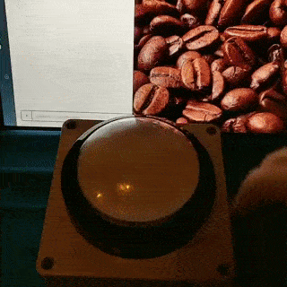

# markentier.tech labs

**Collection of electronics/maker projects.**

* [fivebeans Coffee Notification Button](./fivebeans-cnb/README.md)
  

## Notes

Most code projects will use [platformIO](https://platformio.org/) setup for source code.
It shouldn't be too difficult to use them with an [Arduino IDE](https://www.arduino.cc/en/Main/Software) again if needed.
PCB designs are done with [KiCAD](http://kicad-pcb.org/).

I won't describe each project in detail, the READMEs will be pretty barebone sometimes.
Source code, schematics, layout, and Gerber files are provided as-is.

In general this repo serves mostly as a public backup and share for the interested folks.

### License and Open Source information

If not stated otherwise all files authored by me are dual-licensed under [MIT license](./LICENSE-MIT) and [Creative Commons CC-BY-SA 4.0](./LICENSE-CC); third party symbols and footprints might fall under different licenses.
KiCAD data usually uses a [Creative Commons CC-BY-SA 4.0](https://creativecommons.org/licenses/by-sa/4.0/legalcode), also read <http://kicad-pcb.org/libraries/license/> for details and exceptions/waiver.
Similar rules apply to the [DigiKey collection](https://github.com/digikey/digikey-kicad-library/).
Thus I try to use KiCAD/DigiKey libraries as much as possible.

The hardware/electronics designs are published in accordance with the [statement of principles and definition of the Open Source Hardware Association](https://www.oshwa.org/definition/).

_If you believe I violate anyone's rights or wrongly relicense their work, please contact me (open an issue) and let's find a suitable solution for all involved parties._

I use the MIT license out of habit and since it's short and unrestricted (the ISC or 0BSD might be suitable candidates as well). The CC license is used, because it seems to be widely adopted in the Open Source Hardware community, so I want to the open in that direction, too. Since I find it too cumbersome to individually declare, both source code and any other media (schematics, layouts, ...) fall under the same dual licensing, even though Creative Commons is usually not used for source code. As you might find it unsuitable (and CC itself recommends not doing it anyway), consider using the source code under the MIT license instead. No, no third option will be introduced anytime soon.

### OSHW Statement of Principles 1.0

> Open source hardware is hardware whose design is made publicly available so that anyone can study, modify, distribute, make, and sell the design or hardware based on that design. The hardware's source, the design from which it is made, is available in the preferred format for making modifications to it. Ideally, open source hardware uses readily-available components and materials, standard processes, open infrastructure, unrestricted content, and open-source design tools to maximize the ability of individuals to make and use hardware. Open source hardware gives people the freedom to control their technology while sharing knowledge and encouraging commerce through the open exchange of designs.

— <https://www.oshwa.org/definition/>

### Quote from "OSI Mission"

> Open source enables a development method for software that harnesses the power of distributed peer review and transparency of process. The promise of open source is higher quality, better reliability, greater flexibility, lower cost, and an end to predatory vendor lock-in.

— <https://opensource.org/about>
