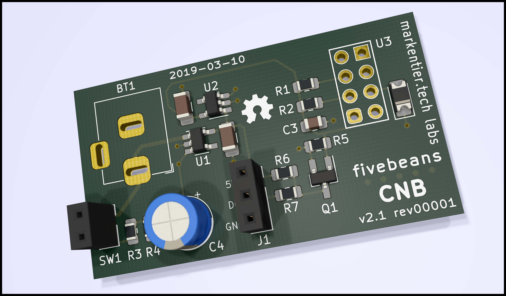

# fivebeans Coffee Notification Button

An ESP8285 (or ESP8266) which sends a Slack message into a channel once a big button is pressed.

Show status of progress with a 24 pixel WS2812B LED ring (also known as Neopixel).

After job is done, the ESP will be turned off (so it needs an LDO with ENABLE/SHUTDOWN pin).

_More details will follow soon._

## Images and short videos

<small>`PCB rendering for v2.1 rev1`</small>

* Early prototype (Jan 2018)
  * 🎥 https://www.instagram.com/p/BefYRcdHyhK/
  * 📸 https://www.instagram.com/p/Begb8exn_ND/
* Next version on a breadboard
  * 🎥 https://www.instagram.com/p/Btrnet4omIN/
  * 📸 https://www.instagram.com/p/BtrqztWIw97/
* First self-designed PCB prototype
  * 📸 https://www.instagram.com/p/Bt_dyOYBbQA/
  * 📸 https://www.instagram.com/p/BuC8_eaBRkF/
* Second self-designed PCB prototype
  * _coming soon_

## Frameworks

Per default the Arduino framework is used and code should be usable in their IDE.

There are other frameworks usable with ESP8266/ESP8285, but haven't done any testing yet.
Especially for JSON support one should look for a generic C/C++ library suitable for embedded devices.

### nonOS SDK

Framework: https://github.com/espressif/ESP8266_NONOS_SDK

Compatible platformio libraries: https://platformio.org/lib/search?query=framework:%22esp8266-nonos-sdk%22

### RTOS SDK

Framework: https://github.com/espressif/ESP8266_RTOS_SDK

Compatible platformio libraries: https://platformio.org/lib/search?query=framework:%22esp8266-rtos-sdk%22
