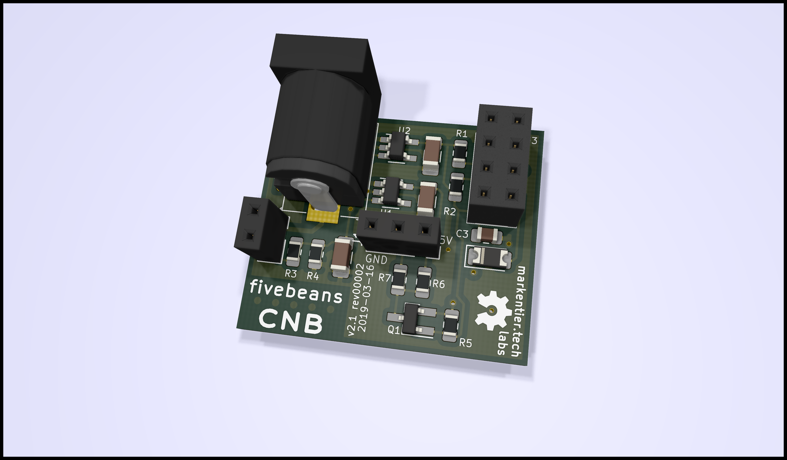
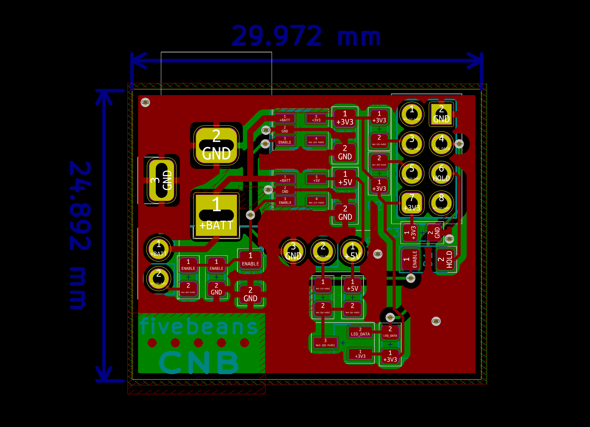

# fivebeans Coffee Notification Button

  

An ESP8285 (or ESP8266) which sends a Slack message into a channel once a big button is pressed.

Show status of progress with a 24 pixel WS2812B LED ring (also known as Neopixel).

After job is done, the ESP will be turned off (so it needs an LDO with ENABLE/SHUTDOWN pin).

It's basically an overcomplicated "dash button" with fancy lights in a button and housed in a very huge case.
Funnily enough I shrunk the PCB way more than needed for the case, but I liked this challenge and wanted to get familiar with SMD soldering anyway.

## Future ideas

* use an SMD version of the ESP8266 (like ESP-12F)
* use an ESP-32 and utilize the 2 cores (main task doing all the communication + secondary task keeping the lights running concurrently)
* use an SMD ATtiny## with the ESP82## for concurrently driving the LEDs?
* _Do you have an interesting idea? Open an issue and tell me!_

The SMD ESPs would make the board bigger again, because I need to mount them somehow to the PCB, but that's okay probably. Certainly I don't want to use th bare chips and deal with antenna magic, I leave [this journey](https://www.youtube.com/watch?v=am68wkDK9UE) to the [Unexpected Maker](https://github.com/unexpectedmaker).

## Images and short videos

<small>`PCB 3D rendering for v2.1 rev1`</small>

<small>`PCB schematic rendering for v2.1 rev1`</small>

* Early prototype (Jan 2018)
  * 🎥 https://www.instagram.com/p/BefYRcdHyhK/
  * 📸 https://www.instagram.com/p/Begb8exn_ND/
* Next version on a breadboard (Feb 2019)
  * 🎥 https://www.instagram.com/p/Btrnet4omIN/
  * 📸 https://www.instagram.com/p/BtrqztWIw97/
* First self-designed PCB prototype (Feb 2019)
  * 📸 https://www.instagram.com/p/Bt_dyOYBbQA/
  * 🎥/📸 https://www.instagram.com/p/BuC8_eaBRkF/
* v2.1 rev00001 (March 2019)
  * 📸 https://www.instagram.com/p/BvDQuSpnnQZ/
  * 📸 https://www.instagram.com/p/BvFaA8wnASO/
* v2.1 rev00002 (March 2019)
  * _coming soon_

## Components

| Component  | Amount  | Notes  |
|---|---|---|
| PCB  | 1  | see kicad project  |
| ESP8285  | 1  | an ESP8266 should still work  |
| WS2812B 24 pixel ring  | 1  | RGB LEDs; so called Neopixel ring  |
| 18650 cell  | 2  | 2000mAh or better  |
| battery holder (for 2 cells)  | 1  | with a DC Jack connector  |
| wires (Dupont)  | 5  | for button and LED ring  |
| (components for PCB)  | many  | _tbd (check kicad schematic)_ |

## Frameworks

Per default the [ESP8266 Arduino framework](https://github.com/esp8266/Arduino) is used and code should be usable in their IDE.

There are other frameworks usable with ESP8266/ESP8285, but haven't done any testing yet.
Especially for JSON support one should look for a generic C/C++ library suitable for embedded devices.

### nonOS SDK

Framework: https://github.com/espressif/ESP8266_NONOS_SDK

Compatible platformio libraries: https://platformio.org/lib/search?query=framework:%22esp8266-nonos-sdk%22

### RTOS SDK

Framework: https://github.com/espressif/ESP8266_RTOS_SDK

Compatible platformio libraries: https://platformio.org/lib/search?query=framework:%22esp8266-rtos-sdk%22
